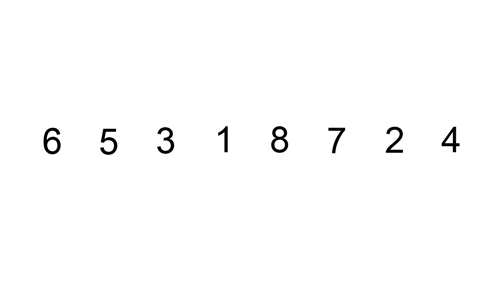

# Sorting
## Bubble Sort - O(n^2)

## Selection Sort - O(n^2)

## Insertion Sort - O(n^2)

## Heap Sort - O(nlog(n))
Push all elements into a heap. Repeatedly get min/max of heap. Will return in sorted
order. Insertion into heap is O(log(n)), as heap property must be maintained.
There are n elements, hence O(nlog(n)) complexity. 

## Merge Sort - O(nlog(n))
Repeatedly divide array into halves until at single element, merge halves recursively
maintaining order. The recursive dividing of the array leads to O(nlog(n)) complexity.
This is because at most O(log(n)) divisions / merges occur recursively. For each
division / merge we must iterate through n elements.

## Quick Sort - Θ(nlog(n)) O(n^2)
The runtime of Quick Sort depends on the pivot. If the pivot is poorly chosen we will
divide the array into 1 and n-1 size. This leads to n divisions and iterating through
n elements for each division O(n^2). The average complexity assumes pivot will land
roughly in the middle of the array each time. This leads to O(log(n)) divisions and
hence Θ(nlog(n)).

## Topological Sort (Graph | Directed | Acyclic )
DFS algorithm is faster for larger graphs.
### DFS Algorithm - O(V+E)
Must make sure there are no cycles in graph prior to running topological sort. Perform Depth First Search, keep track of visited nodes. After node has visited all children, add it to stack. Pop all values from stack, this is topological ordering. Complexity is due to needing to explore all nodes and all edges for DFS algorithm.

### Kanh's Algorithm - O(V+E)
Find node with zero input edges. Add to output. Remove from graph adjacency list. Repeat until no nodes left.

# Misc
## Divide and Conquer
Come up with a way to divide the problem into smaller sub problems. When we divide a problem repeatedly into halves
the complexity will end up being O(log(n)). The reason for this is because a log is the inverse of exponentiation. Log base 2 tells us the number of times something has been doubled. Put another way it tells us how many times we can divide a dataset in half. With big O notataion we drop the log base. This is why we are left with a complexity of O(log(n)). https://medium.com/@monidavies/understanding-o-log-n-time-complexity-20e5f7a942d7

## Minimum Spanning Tree (Graph)
### Prim's Algorithm
### Kruskal's Algorithm
## Network Flow (Graph)
## Bipartite Matching (Graph)
## Strongly Connected Components (Graph)
## Backtracking
## Dynamic Programming
## NP Completeness

# Searching
## Binary Search (Sorted) - O(log(n))
Requires that input data is sorted. Select middle point. Compare to target value. If equal return. If less use data to left of midpoint. If greater use data to right of midpoint. Recursively repeat until value is found or we run out of data. This divide and conquer approach leads to a complexity if O(log(n)) as the search space is divided in two with each check.

## Depth First Search (Graph) - O(V+E)
Go deep first. O(V+E) complexity comes from checking each Vertex (V) once and checking each edge (E) once.

### Recursion
Call recursive dfs function on root node to initalise. Recursively call dfs function on children of current node. If node is nullptr return (do nothing).
### Stack
Must use stack data structure. Initialise by adding root node to stack. While stack is not empty, pop from stack. Add all children to the stack. Be aware that a stack will reverse the order that children are iterated through.

## Breadth First Search (Graph) - O(V+E)
Go wide first. O(V+E) complexity comes from checking each Vertex (V) once and checking each edge (E) once.

Must use queue data structure. Initialise by adding root node to queue. While queue is not empty, pop from queue. Add all children to the queue.

## Dijkstra's Algorithm (Graph | Greedy) - O((V+E)log(V))
Form a table with each node, taking note of the shortest distance and the previous node on the shortest path. Initially the shortest distance will be infinity/none. Starting at begining node search neighboring nodes ordering by the closest node first (greedy approach). 
Take note of visited nodes so we don't repeat steps.
Update the shortest path of visited nodes if the current distance is shorter than the previous value in the table and update the previous node only if the distance was shorter. Can use table to reconstruct shortest path backwards. Using a priority queue to organise next nodes to visit by distance is what leads to complexity of O((V+E)log(V)). Using a priority queue to sort the data only makes sense if the graph is sparse enough i.e the number of edges is much less than the total possible number of edges.

## Bellman-Ford Algorithm
Form a table of shortest distances to each node, where the values are originally set to infinity / none. Edges do not need to be processed in any particular order. Iterate through edges calculating distance. Perform V-1 iterations to get correct distance for all nodes. Is capable of detecting negative cycles and working with negative values. We run the algorithm with one additional iteration to check for negative cycles. If any of the vertex shortest distances are updated then we have a negative cycle.

## A* Algorithm

# Data Structures
## Array
## Linked List
## Stack
## Queue
## Tree
### Binary Tree
### BST
#### AVL Tree
#### Red Black Tree
### Heap
## Trie
## Vector
## HashTable
## Graph
## Union Find