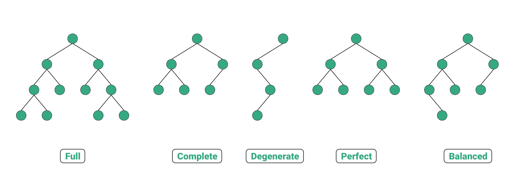

# Sorting
## Bubble Sort - O(n^2)

## Selection Sort - O(n^2)

## Insertion Sort - O(n^2)

## Heap Sort - O(nlog(n))
Push all elements into a heap. Repeatedly get min/max of heap. Will return in sorted
order. Insertion into heap is O(log(n)), as heap property must be maintained.
There are n elements, hence O(nlog(n)) complexity. 

## Merge Sort - O(nlog(n))
Repeatedly divide array into halves until at single element, merge halves recursively
maintaining order. The recursive dividing of the array leads to O(nlog(n)) complexity.
This is because at most O(log(n)) divisions / merges occur recursively. For each
division / merge we must iterate through n elements.

## Quick Sort - Θ(nlog(n)) O(n^2)
The runtime of Quick Sort depends on the pivot. If the pivot is poorly chosen we will
divide the array into 1 and n-1 size. This leads to n divisions and iterating through
n elements for each division O(n^2). The average complexity assumes pivot will land
roughly in the middle of the array each time. This leads to O(log(n)) divisions and
hence Θ(nlog(n)).

## Topological Sort (Graph | Directed | Acyclic )
DFS algorithm is faster for larger graphs.
### DFS Algorithm - O(V+E)
Must make sure there are no cycles in graph prior to running topological sort. Perform Depth First Search, keep track of visited nodes. After node has visited all children, add it to stack. Pop all values from stack, this is topological ordering. Complexity is due to needing to explore all nodes and all edges for DFS algorithm.

### Kanh's Algorithm - O(V+E)
Find node with zero input edges. Add to output. Remove from graph adjacency list. Repeat until no nodes left.

# Misc
## Kth Sorted Value
### Heap Method
Push all values into a heap and pop K times. Will give you the Kth smallest/largest number depending on if you use a max or min heap.

### Quick Select
Quick Select allows us to find the Kth smallest/largest element by using the same pivot function from quicksort. However we only perform the algorithm recursively on the side where we know the index should be. I.e. the second smallest value will be at index 1. The smallest will be at index 0. We randomly choose a pivot, partition around the pivot. If the pivot ends up at the target index then we have found the Kth smallest/largest value. If the target index is less than pivot repeat with data on the left, otherwise repeat with data on the right.

## Divide and Conquer
Come up with a way to divide the problem into smaller sub problems. When we divide a problem repeatedly into halves
the complexity will end up being O(log(n)). The reason for this is because a log is the inverse of exponentiation. Log base 2 tells us the number of times something has been doubled. Put another way it tells us how many times we can divide a dataset in half. With big O notataion we drop the log base. This is why we are left with a complexity of O(log(n)). https://medium.com/@monidavies/understanding-o-log-n-time-complexity-20e5f7a942d7

## Minimum Spanning Tree (Graph)
The shortest path to connect all nodes together in the graph. Not Unique, graph can have multiple MST.
### Prim's Algorithm

#### Lazy - O(Elog(E))
Similar to Dijkstra's Algorithm, but instead of choosing the shortest path, chooses the shortest edge each time.

#### Eager - O(Elog(V))
Similar to Lazy Prims but keeps track of only one incoming edge per node and updates that edge within the priority queue when a better one is found. 

### Kruskal's Algorithm
Sort Edges by acending edge weight, then go through edges in order performing union find on them to combine edges/verticies into larger and larger groups until there is only one group left, the minimum spanning tree. Note if a vertex is already part of a group then ignore that edge.

## Network Flow (Graph)
Augmenting Path - where flow is allowed from S to T. Once there are no more augmenting paths we are finished with the algorithm. Bottleneck is the smallest edge on an augmenting path. Augmenting The Flow - we update the flow along the path to be the bottleneck value. Residual Edges / Back Edges - allow us to correct mistakes when choosing a non-optimal augmenting path for flow between S and T. To get the max flow sum the bottleneck values from all of the augmenting paths.

The different types of network flow algorithms occur from how we choose augmenting paths. 

### Ford Fulkerson Algorithm - O(fE)
Uses DFS to find augmenting paths. Where f is the maximum flow and E is the number of edges.

### Edmons-Karp Algorithm - O(E^2 V)
Uses BFS to find augmenting paths. Where E is number of edges and V is the number of verticies.

### Cut Method (By Hand Only)
 The cut method is a another way to solve netflow flow problems by hand. Draw lines through sections leading from one side of the graph to the other (S to T). The cut with the minimum total edge value summed together is the min cut (there can be multiple). These values summed together for the min cut is the max flow for the network. 

## Bipartite Matching (Graph)
Bipartite matching is how to match sets of data together in a graph. I.e. matching jobs to potential employees or matching boys to girls.

In the following example we are matching people to books that they want to read. We are asking what is the maximal cardonality, i.e. what is the maximum number of people we can match to books. Can everyone read one of their prefered books at the same time?

This calculation can be done in a number of different ways one of them is to use a network flow algorithm. The resulting graph along with the flow indicate which books should go to which people to maximise the flow i.e. achieve maximum cardonality. Weights can be adjusted in the flow diagram to allow for multiple books to be allocated to a single person, for multiple copies of books to exist and for people to be allow to checkout multiple copies of a single book.

## Strongly Connected Components (Graph)
Components that can all reach eachother. I.e. components that form a cycle.

### Targan's Algorithm
Randomly pick an unvisited starting node. Perform DFS on this node as we visit each node assign it a low link value. I.e. start numbering the nodes in the order you visit them 0 to n. Each of the nodes that are visited during a single DFS run are considered as nodes we are currently visiting. If we encounter a node we are already visiting we have a cycle! Compare the low link values of the two nodes and set the low link values of both nodes to the minimum of the two low link values. As we backtrack after searching we again update the low link values of the nodes. We mark the visiting nodes as visited on the backtrack. We then repeat this whole algorithm again on unvisited nodes.

### Kosaraju's Algorithm
Another was of checking for strongly connected components, but instead we simply reverse the graph and see if we can still reach components in both cases.

## Backtracking
Keeping track of previous moves so that we can go back if we make a mistake/non-optimal choice. This is typically done with recursion.

## Dynamic Programming
Memorising previous results to use in future calculations to reduce the complexity of the calculion.

A simple example is calculating fibonacci numbers fib(n) = fib(n-1) + fib(n-2). Most of the calculations are redundant if we store the previous results.

## NP Completeness

# Searching
## Binary Search (Sorted) - O(log(n))
Requires that input data is sorted. Select middle point. Compare to target value. If equal return. If less use data to left of midpoint. If greater use data to right of midpoint. Recursively repeat until value is found or we run out of data. This divide and conquer approach leads to a complexity if O(log(n)) as the search space is divided in two with each check.

## Depth First Search (Graph) - O(V+E)
Go deep first. O(V+E) complexity comes from checking each Vertex (V) once and checking each edge (E) once.

### Recursion
Call recursive dfs function on root node to initalise. Recursively call dfs function on children of current node. If node is nullptr return (do nothing).
### Stack
Must use stack data structure. Initialise by adding root node to stack. While stack is not empty, pop from stack. Add all children to the stack. Be aware that a stack will reverse the order that children are iterated through.

## Breadth First Search (Graph) - O(V+E)
Go wide first. O(V+E) complexity comes from checking each Vertex (V) once and checking each edge (E) once.

Must use queue data structure. Initialise by adding root node to queue. While queue is not empty, pop from queue. Add all children to the queue.

BFS is also used to find the shortest path in an unweighted graph.

## Dijkstra's Algorithm (Graph | Greedy) - O((V+E)log(V))
Form a table with each node, taking note of the shortest distance and the previous node on the shortest path. Initially the shortest distance will be infinity/none. Starting at begining node search neighboring nodes ordering by the closest node first (greedy approach). 
Take note of visited nodes so we don't repeat steps.
Update the shortest path of visited nodes if the current distance is shorter than the previous value in the table and update the previous node only if the distance was shorter. Can use table to reconstruct shortest path backwards. Using a priority queue to organise next nodes to visit by distance is what leads to complexity of O((V+E)log(V)). Using a priority queue to sort the data only makes sense if the graph is sparse enough i.e the number of edges is much less than the total possible number of edges.

## Bellman-Ford Algorithm
Form a table of shortest distances to each node, where the values are originally set to infinity / none. Edges do not need to be processed in any particular order. Iterate through edges calculating distance. Perform V-1 iterations to get correct distance for all nodes. Is capable of detecting negative cycles and working with negative values. We run the algorithm with one additional iteration to check for negative cycles. If any of the vertex shortest distances are updated then we have a negative cycle.

## A* Algorithm

# Data Structures
## Array
Contiguous block of memory that can be indexed / updated in constant time O(1), but insertion / deletion of new values takes O(n) time and requires reallocation of memory.

## Vector (Amortized)
Automatically allocates to arrays underneath. Over allocates memory so that allocations are not needed with every insertion. If allocations occur rarely then the amortized time complexity of insertions/deletions are constant O(1).

## Linked List
Non contiguos nodes of memory that point from one to the next. Can also point backwards in doubly linked list.
O(1) insertion/deletion and O(n) lookup (note that insertion/deletion into anything but the ends of the link list will require a O(n) lookup first unless we already have pointer to data elsewhere).

## Stack
LIFO - Last In First Out. Like a stack of plates. Very fast O(1) push, pop and top opperations. Typically implemented using a linked list to get O(1) insertions.

## Queue
FIFO - First In First Out. Like waiting in line.
Very fast O(1) push, pop and front oppertations. Typically implemented using a linked list to get O(1) insertions.

## HashTable / HashMap
Map one data type to another. Uses a large vector underneath and a hashing function to convert input data type into a index within the internal vector. Since hashmap uses an underlying vector, amortised operations are O(1). 

## Graph
A Graph is a collection of nodes. These nodes can be connected to eachother or can be separate from one another. Graphs can be directed i.e. can only move in one direction. Graphs can also be weighted, 

## Tree
A connected graph that contains no cycles.

### Binary Tree
A binary tree is a tree that has at most two children.

### BST
Binary Search tree is a binary tree which is ordered from smallest to largest. All child nodes on the left of parent are smaller. All the child nodes on the right of parent are larger. Insertion, Searching and Deletion all occur in O(log(n)) time as the search space is repeatedly divided in half, by asking is the target, equal, greater or less then the current node similar to binary search. This is why it is called a binary search tree. All data that is inserted into the BST remains ordered, however a BST may become unbalanced. An unbalanced BST can degenerate into a linked list. This would mean that all opperations would become O(n).

When deleting elements from a BST there are three cases.
* Target = Leaf Node - no side effects
* Target has 1 child. Replace target with child
* Target has 2 children. Find either the maximum in the left subtree or minimum in the right subtree. Replace the target with this value. Then repeat the deletion step for the max/min value that was found as we will now have a duplicate value in the BST.

### Balanced BST (BBST)
Balanced binary search tree maintains the balance of nodes in a BST to avoid the tree degenerating into a linked list. O(log(n)) for all operations.

Each type of BBST has an invarient that decides of the BBST is balanced or not. Each type of BBST can be re-balanced by performing tree rotations.

#### AVL Tree
Invarient is balanced factor (BF) which is the height difference between the right and left subtrees. BF(node) = H(node.right) - H(node.left). Height H(x) is defined as the number of edges between node x and the furthest leaf node. The BF must be -1. 0 or +1. No other values are allowed, otherwise rotations must occur to restore balance.

After each insertion / deletion the BF must be updated and the tree must be balanced accordingly.

#### Red Black Tree
## Heap / Priority Queue
A heap can be implemented as a tree or as an array. The array form is more efficient, although it is still easier to visualise it as a tree regardless of implementation. The root/first value of the heap is always the min or max value depending on if you are using a min or max heap respectively. In a min heap the parent node must always be smaller then child nodes. In a max heap the parent must always be larger then the child nodes. When we insert/delete a value in heap we must maintain the heap property. With insertion we put the value in the next available spot in the heap as a leaf node and bubble up values to restore heap property. With deletion we remove the root/first value and move the last node / value into the root position. We then float the value down the heap to restore the heap property.  

## Trie
A trie (prenounced try) is a data structure that can check for string pattern matching quickly by storing the possible combinations of letters/symbols as nodes in a tree. All opperations, insertion, deletion and searching all take O(n) time.

## Union Find
Union Find is a data structure that groups elements together (union) and can check if one element is in the same group as another (find). This is done by keeping an array where there is a single index for each element (and a map that hashes data to index if required). The data in the array points to the index of another element in the group. Initially each element points to itself. Path compression updates the index of elements to point to root of group whenever possible to mimimise the amount of indirection when determining if two elements belong to the same group. With path compression union find is O(1) amortised time for both opperations union and find.

# Design Patterns
Solutions to commonly occuring software engineering problems when writting code. It's important to note that there are functional versions of each of the design patterns that don't have to use OOP and inheritance.

## Singleton - (Creational Pattern)
Singletons are classes where there is only ever one instance. (i.e. the constructor is private). They are typically used to wrap around some global data / global functions like a namespace. There are several different ways of implementing them without classes i.e. a namespace with functions and state, but these are essentially doing the same thing. The advantage of still using a class is the ability to have setup / taredown still handling in constructor and destructor of the class.

## Factory - (Creational Pattern)
A factory is a class that can contruct many different types of object based on input parameters.

